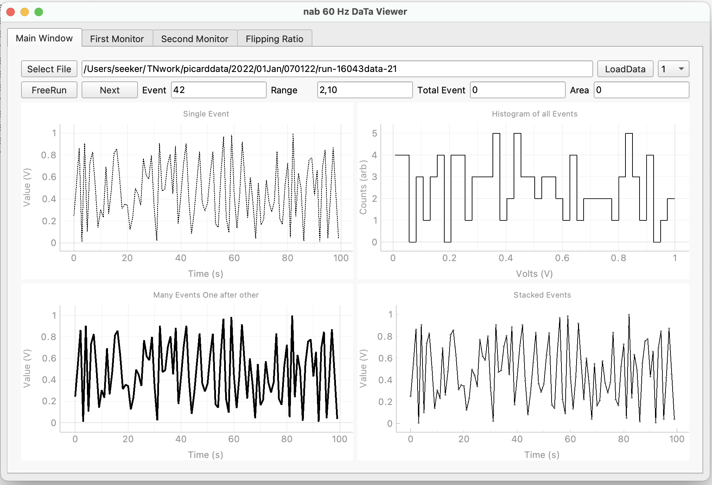

# nabonlineviewer
This is the online Data Viewer and quick Analysis tool for Nab experiment at SNS

Requirements:
Numpy, matplotlib, PyQt5, pyqtgraph

Install with conda
conda install -c conda-forge pyqt pyqtgraph numpy matplotlib

Install with pip
pip install PyQt5 pyqtgraph numpy matplotlib

Version 0.00
-- This is a very first draft and just the copy of another display program for our DAQ system.

